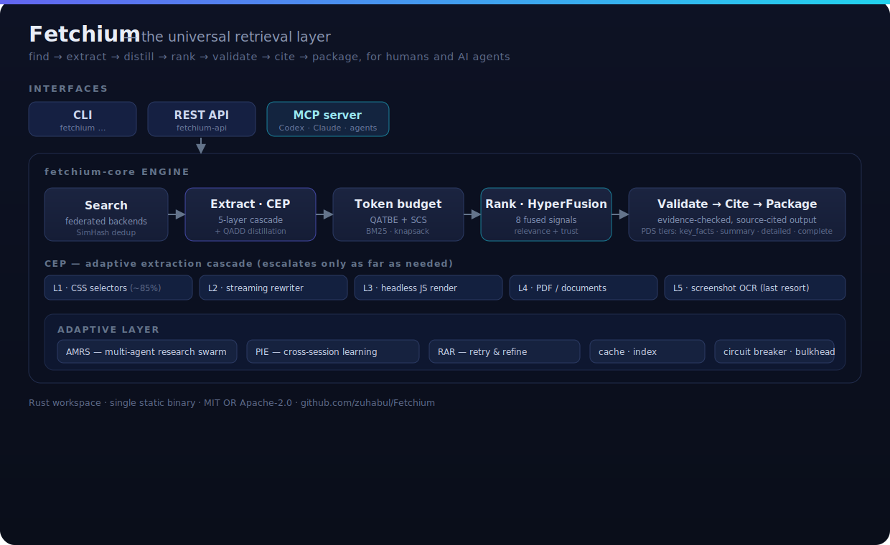

<div align="center">

```
███████╗███████╗████████╗ ██████╗██╗  ██╗██╗██╗   ██╗███╗   ███╗
██╔════╝██╔════╝╚══██╔══╝██╔════╝██║  ██║██║██║   ██║████╗ ████║
█████╗  █████╗     ██║   ██║     ███████║██║██║   ██║██╔████╔██║
██╔══╝  ██╔══╝     ██║   ██║     ██╔══██║██║██║   ██║██║╚██╔╝██║
██║     ███████╗   ██║   ╚██████╗██║  ██║██║╚██████╔╝██║ ╚═╝ ██║
╚═╝     ╚══════╝   ╚═╝    ╚═════╝╚═╝  ╚═╝╚═╝ ╚═════╝ ╚═╝     ╚═╝
```

### The universal retrieval layer for humans and AI agents

Rust-native search, extraction, ranking, and synthesis — delivered as a CLI, a REST API, and an MCP server.

[](https://github.com/zuhabul/Fetchium/actions/workflows/ci.yml)
[](#license)
[](https://www.rust-lang.org)
[](https://crates.io/crates/fetchium-cli)
[](https://www.npmjs.com/package/fetchium-cli)
[](https://crates.io/crates/fetchium-cli)

[Install](#installation) · [Architecture & innovations](#architecture--innovations) · [Quick start](#quick-start) · [For AI agents](#for-ai-agents) · [Docs](docs/)

</div>

---

## What is Fetchium?

Most "search" tools hand an LLM a wall of raw HTML and hope for the best. Fetchium is built for the
opposite: it **finds, fetches, extracts, ranks, validates, and packages** information so that the
output is clean, cited, and token-efficient — whether the consumer is a human at a terminal or an
AI agent over the network.

It runs as a single Rust binary with no required runtime dependencies and exposes one engine three ways:

- **CLI** — `fetchium search`, `fetch`, `summarize`, `compare`, `research`, and more.
- **REST API** (`fetchium-api`) — the engine over HTTP for any language.
- **MCP server** (`fetchium-mcp`) — a first-class tool for AI agents (Codex, Claude, any MCP client).

## Why Fetchium

- **Token-efficient by design** — extraction and packaging are query-aware, so agents spend context on signal, not boilerplate.
- **Evidence-first** — results carry sources and citations, with a validation pass before output.
- **Adaptive** — extraction and ranking escalate only as far as a query needs, keeping latency and cost down.
- **Agent-native** — MCP + REST + LangChain/CrewAI adapters, not an afterthought.
- **Resilient** — per-backend circuit breakers and bulkheads keep one slow/broken source from sinking a query.

### How it compares

|  | Naive retrieval (raw HTML → LLM) | **Fetchium** |
|--|--|--|
| **Extraction** | dump full HTML, hope the model copes | adaptive 5-layer **CEP** cascade + **QADD** DOM distillation |
| **Token cost** | pays for nav, ads, scripts, boilerplate | query-aware **QATBE/SCS** packing into a fixed budget |
| **Ranking** | first result / single relevance score | **HyperFusion** — 8 fused signals (relevance, trust, recency, diversity…) |
| **Trust** | unattributed text | evidence validation + **source citations** |
| **Depth control** | all-or-nothing | **PDS** tiers: `key_facts` → `summary` → `detailed` → `complete` |
| **Research** | one query, one shot | **AMRS** swarm: decompose → search → synthesize → verify |
| **Reliability** | one bad source breaks the run | circuit breakers + bulkheads + SimHash dedup |
| **Agent access** | bespoke glue per agent | native **MCP** + REST + LangChain/CrewAI adapters |

---

## Architecture & innovations

<div align="center">
  
</div>

Fetchium's engine (`fetchium-core`) is a pipeline of purpose-built components. The novel pieces:

### CEP — Content Extraction Protocol (5-layer adaptive cascade)
Extraction escalates layer by layer and stops as soon as the content is good enough, so the cheap
path handles the common case and expensive paths run only when needed.

| Layer | Technique | Handles |
|------:|-----------|---------|
| 1 | HTML + CSS selectors (`scraper`) | ~85% of pages |
| 2 | Streaming HTML rewriter (`lol_html`) | enhanced boilerplate removal |
| 3 | Headless JS rendering | SPAs / dynamic content *(`headless` feature)* |
| 4 | PDF / document extraction | PDF, DOCX, RTF |
| 5 | Screenshot OCR | image-heavy / canvas content *(`headless` feature)* |

A learned predictor (`cep_predictor`) chooses where to start instead of always running Layer 1.

### QADD — Query-Aware DOM Distillation
Prunes the DOM against the query *before* extraction, dropping nav/ads/chrome to cut tokens
dramatically (design target ~10–20×) while keeping query-relevant content.

### QATBE + SCS — token-budgeted, semantically segmented extraction
**SCS** splits content into typed semantic segments; **QATBE** (Query-Aware Token-Budgeted
Extraction) scores segments with BM25 and packs the best ones into a fixed token budget
(greedy knapsack) — you get the most relevant content that fits, not an arbitrary truncation.

### PDS — Progressive Detail Streaming
The same result can be served at four tiers — `key_facts` (~200 tok) → `summary` (~1k) →
`detailed` (~5k) → `complete` — so callers request exactly the depth they need.

### HyperFusion — 8-signal ranking
Final ranking fuses eight independent signals rather than a single relevance score:
**BM25, semantic, temporal, authority/trust, evidence, diversity, quality, and consensus/cluster**
(`rank/{bm25,semantic,temporal,trust,evidence,diversity,quality,cluster}.rs`).

### AMRS — Adaptive Multi-Agent Research Swarm
`fetchium research` decomposes a question and runs a swarm of cooperating agents
(`research/amrs/`) — decompose → search → synthesize → verify — to produce a cited report.

### Evidence, validation & citations
Results flow through a validation stage and a citation layer (`validate/`, `citation/`,
`rank/evidence.rs`) so claims are backed by sources before they reach the output.

### PIE — Persistent Intelligence Engine
Cross-session learning (source trust, failure patterns, query prediction) persisted locally,
so the engine improves with use instead of starting cold each time.

### RAR — Retry-and-Refine
A multi-checkpoint self-correction loop that detects weak results and refines the query/extraction
rather than returning a poor answer.

### Resilience
Every backend call is wrapped in a **circuit breaker** and **bulkhead** (`resilience/`), with
**SimHash**-based de-duplication across federated backends — one degraded source can't stall a query.

### Pipeline
```
            ┌──────────── research/ (AMRS) ────────────┐
            ▼                                           │
search/ → extract/ (CEP + QADD) → token/ (QATBE/SCS) → rank/ (HyperFusion) → validate/ → citation/ → output/ (PDS)
            ▲                                                                                   │
            └───────────────── cache/ · index/ · intelligence/ (PIE) ───────────────────────────┘
```

---

## Installation

> Requires [Rust 1.75+](https://rustup.rs) for the Cargo/source methods.

```bash
# Shell installer (Linux + macOS — all architectures)
curl -sSfL https://install.fetchium.com | sh

# Cargo
cargo install fetchium-cli

# npm / npx
npm install -g fetchium-cli
npx fetchium-cli --help

# Homebrew
brew install zuhabul/fetchium/fetchium

# Python adapters
pip install fetchium-langchain   # LangChain retriever
pip install fetchium-crewai      # CrewAI tool

# Build from source
git clone https://github.com/zuhabul/Fetchium && cd Fetchium
cargo build -p fetchium-cli --release
```

Then run `fetchium doctor` to check optional tools.

## Quick start

```bash
# ── Core retrieval ────────────────────────────────────────────────────────────
fetchium search "best rust async runtimes"           # federated web search (17+ backends)
fetchium fetch https://example.com                   # fetch + clean extraction (CEP)
fetchium research "impact of LLMs on engineering"    # multi-step cited report (AMRS)
fetchium compare "rust vs go vs python"              # structured side-by-side comparison
fetchium summarize https://example.com               # AI summarization of a URL or text
fetchium ai "what causes the northern lights?"       # grounded answer (needs AI provider)
fetchium deep "history of Byzantine Empire"          # deep multi-agent research (Mode E)

# ── YouTube intelligence ──────────────────────────────────────────────────────
fetchium youtube search "rust programming tutorial"  # search YouTube
fetchium youtube analyze https://youtube.com/watch?v=dQw4w9WgXcQ  # analyze video
fetchium youtube transcript https://youtube.com/watch?v=dQw4w9WgXcQ  # extract transcript
fetchium transcribe https://youtube.com/watch?v=dQw4w9WgXcQ  # transcribe any audio/video

# ── Social media intelligence ─────────────────────────────────────────────────
fetchium social "AI regulation news"                 # unified search across all platforms
fetchium reddit search "mechanical keyboards"        # Reddit posts + sentiment
fetchium twitter search "Rust lang"                  # X/Twitter (via Nitter)
fetchium hackernews search "open source tools"       # Hacker News
fetchium tiktok search "programming tips"            # TikTok trends

# ── Productivity / monitoring ─────────────────────────────────────────────────
fetchium monitor add https://example.com             # watch URL for content changes
fetchium monitor check                               # check all monitored URLs now
fetchium digest "AI weekly"                          # generate a research digest
fetchium radar                                       # personalized research radar from history

# ── API / server ──────────────────────────────────────────────────────────────
fetchium serve                                       # start REST API (port 3000)
fetchium serve --mode mcp                            # start MCP server (stdio)
fetchium tui                                         # interactive terminal UI
```

Full command reference: [docs/guide/commands.md](docs/guide/commands.md).

## For AI agents

- **MCP server** (`fetchium-mcp`) exposes retrieval as Model Context Protocol tools for Codex,
  Claude, and other MCP clients.
- **REST API** (`fetchium-api`) serves the same engine over HTTP — `fetchium serve`.
- **Adapters** for [LangChain](adapters/langchain) and [CrewAI](adapters/crewai) live in `adapters/`.

See [docs/guide/agent-integration.md](docs/guide/agent-integration.md).

## Configuration

Configuration lives in `~/.fetchium/config.toml` (with env-var overrides). API keys you provide are
stored locally and never committed. Run `fetchium doctor` to verify provider/tool setup. Optional
integrations: an AI provider (e.g. [Ollama](https://ollama.com)) for `ai`/`research`/`deep`, and
[Chromium](https://www.chromium.org) for CEP Layers 3/5. Details:
[docs/guide/configuration.md](docs/guide/configuration.md).

## Workspace layout

| Crate | Role |
|-------|------|
| [`fetchium-core`](crates/fetchium-core) | The engine: search, extract (CEP/QADD), rank (HyperFusion), validate, research (AMRS), cache, intelligence (PIE) |
| [`fetchium-cli`](crates/fetchium-cli)   | The `fetchium` command-line binary |
| [`fetchium-mcp`](crates/fetchium-mcp)   | Model Context Protocol server |
| [`fetchium-api`](crates/fetchium-api)   | REST API server |

Deeper notes in [docs/architecture/](docs/architecture/); the full design spec is in [`prd.md`](prd.md).

## Contributing

Contributions are welcome — see [CONTRIBUTING.md](CONTRIBUTING.md) for setup and the checks CI runs,
and the [Code of Conduct](CODE_OF_CONDUCT.md). Report security issues per [SECURITY.md](SECURITY.md).

## License

Licensed under either of **MIT** ([LICENSE-MIT](LICENSE-MIT)) **or** **Apache-2.0**
([LICENSE-APACHE](LICENSE-APACHE)) at your option.

This dual license is the Rust ecosystem standard (Rust itself and most crates use it). Two files are
included because each license has its own canonical text: **MIT** is short and maximally permissive,
while **Apache-2.0** adds an explicit **patent grant** that some organizations require. "At your
option" means any user may choose whichever terms suit them — maximizing compatibility.

Unless you state otherwise, any contribution you submit shall be dual-licensed as above, without
additional terms.
